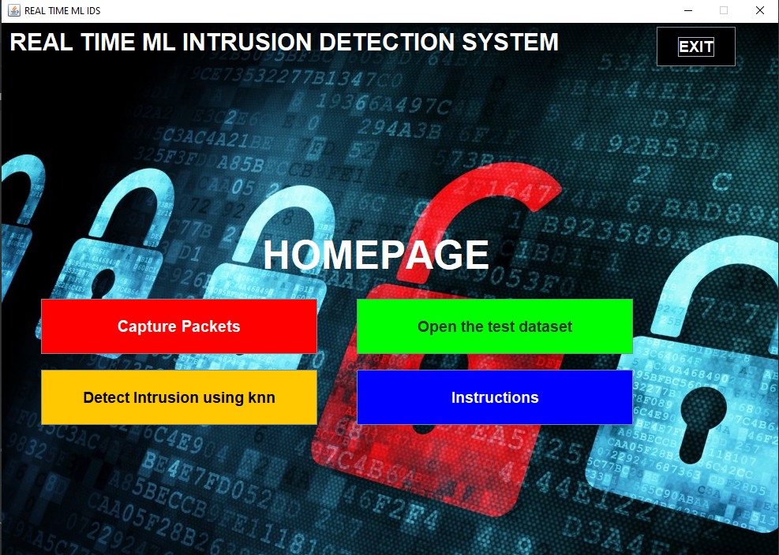

# Realtime-Intrusion-detection-system-using-ml-java-and-python-
The application of using ML in intrusion detection has mostly been limited to research work
and showing results on the formally used kdd99 dataset. In this project I have developed  a 
simple mechanism for realtime intrusion detection using java pcap4j library and python to 
implement the detection. This code is able to detect intrusion with 97% of accuracy using K
nearest Neighbours algorithm.

The java program is completed with gui using simple java swing and it also uses maven support.

you can see the screen shots of GUI below.Dont mind the login screen.

# LOGIN SCREEN

# WORKING OF PROGRAM

Next we have the homepage screen. In this we have all the functions. To use them follow this guide.

1. Capture Packets
2. Remember that this program has a drawback that is you have to select network interface after pressing button from the console
3. Apply the model
4. see results

# HOMEPAGE

# FUTURE IMPROVEMENTS

1. ADD more ml models
2. Improve the GUI
3. Use unsupervised learning
4. Solve the issue of selecting network interface from console
